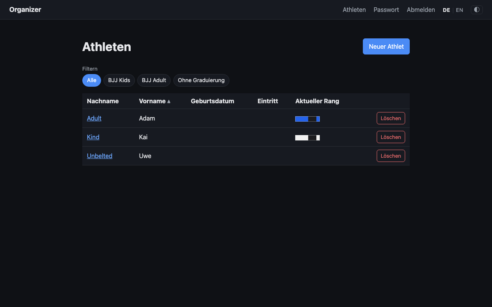
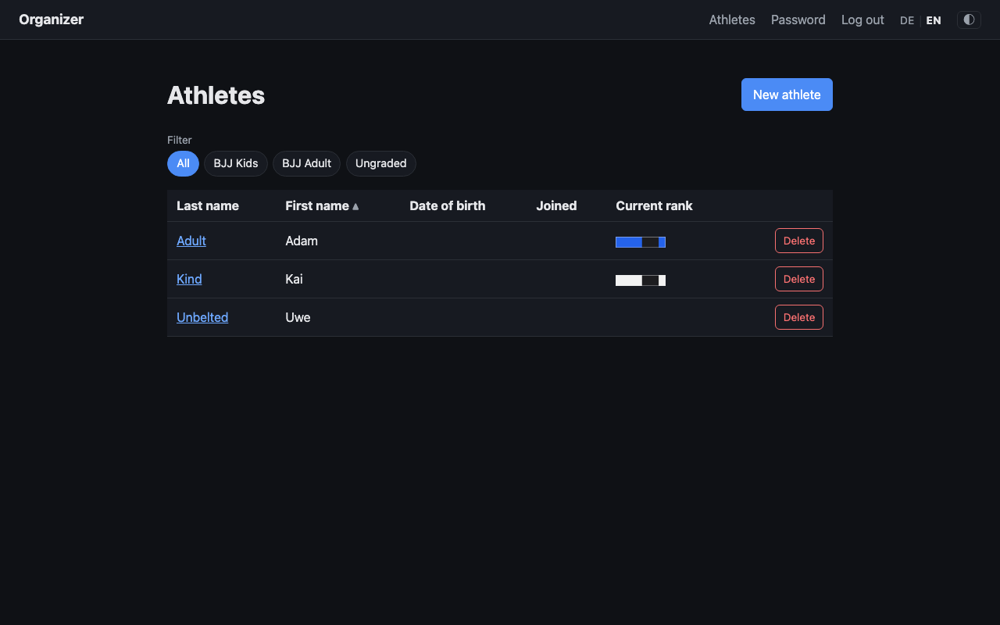
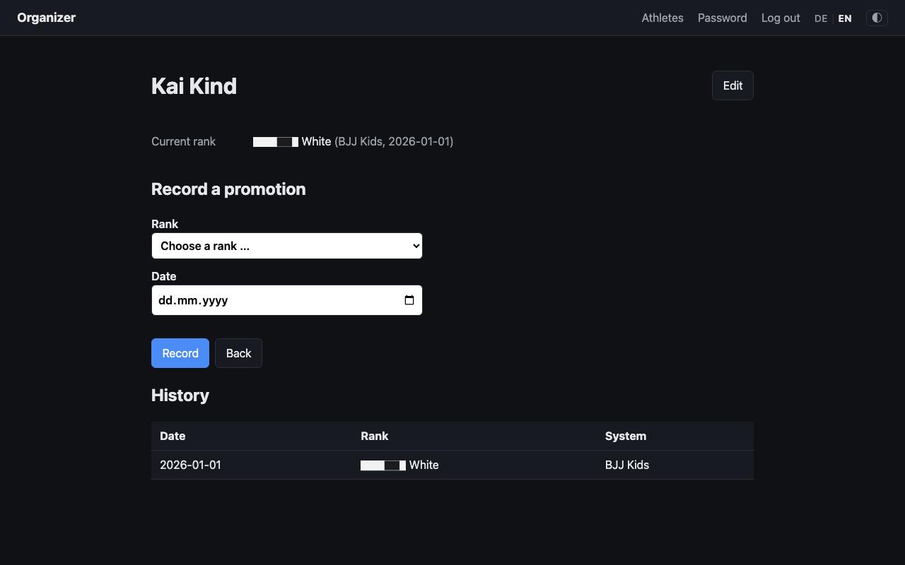

# 01 — UI internationalization (German + English)

Status: done

Make the app bilingual at the UI level, chosen per trainer account. Full detail
and rationale in [`../spec.md`](../spec.md).

## Motivation

Some trainers are not native German speakers; the app is currently German UI with
a few stray English strings (`Athletes` in the nav) and English domain data
(belt names). Building multilingual support in now is far cheaper than
retrofitting later.

## Summary of decisions (see spec)

- **Locale source:** stored per-trainer preference (new `locale` column on
  `trainers`), `Accept-Language` as first-visit/pre-login default, fallback
  German. **No URL prefixes** (behind login, never indexed → SEO rationale gone;
  HTMX inherits locale for free).
- **Scope:** UI chrome + user-facing Go messages only. Domain data (rank/system
  names) parked ([[i18n-domain-data]], likely subsumed by [[rank-belt-visual]]).
  Internal errors + CLI stay English (already clean).
- **Implementation:** homegrown `internal/i18n` + embedded JSON catalogs
  (`de.json`/`en.json`), `{{t "key"}}` template func + Go lookup; no library
  (ADR-0002). Locale-resolution middleware → request context; `<html lang>`
  dynamic; `Accept-Language` via `golang.org/x/text/language`.
- **Switcher:** `DE | EN` toggle in the nav next to the theme toggle,
  `POST /account/language` → update trainer → redirect back.
- **Robustness:** missing key → German fallback → visible key; parity test
  enforces identical key sets across catalogs.

## Acceptance

See spec. Key points: per-account persistent language, `Accept-Language`
first-visit default, all chrome + user messages translated, internal/CLI stay
English, dynamic `<html lang>`, catalog parity test.

## Comments

2026-07-27: [[roster-sortable-columns]] (`c8ff458`) introduced the first
user-facing German UI strings that live in **Go code rather than a template** —
the roster column labels in `rosterColumns` (`internal/web/roster.go`), which the
template renders via `{{range .Headers}}`. The i18n pass must translate those
through the Go-side lookup, not only the `{{t "key"}}` template func; the roster
`<td data-label="…">` attributes carry the same labels a second time (mobile card
layout) and have to stay in sync with them.

2026-07-30: Implemented. `internal/i18n` holds two embedded JSON catalogs and
one ordered `supported` list from which both the `Accept-Language` matcher and
`Supported()` are derived, so the two halves cannot drift. `trainers.locale`
(migration `00005`) carries the account's choice; `resolveLocale` middleware
resolves trainer → `Accept-Language` → German into the request context, which
the renderer and the handlers' own messages read. The renderer parses **one
template set per locale**, which is what keeps the spec's `{{t "key"}}` spelling
without threading a locale through every call. Decisions recorded as
[ADR-0008](../../../docs/adr/0008-ui-language-is-an-account-setting.md).

Notes on decisions the ticket left open:

- **The roster's Go-side labels became catalog keys**, not translated strings
  (`rosterColumns[].LabelKey`), and `athletes.html` repeats those same keys in
  each cell's `data-label`. The shared key is the sync mechanism the comment
  above asked for; `TestRosterColumnLabelsAndCardLabelsStayInSync` fails if the
  two spellings drift.
- **The switcher needs a return target**, which the spec's "redirect back" left
  implicit. It is a hidden field, rebuilt from the *normalised* view state rather
  than echoed from the request URL (otherwise a filter the roster just rejected
  travels back into the page — this actually broke
  `TestRosterUnrepresentedFilterFallsBackToAll` first time round) and validated
  to be an in-app path before it reaches a `Location` header. From a page
  re-rendered by a POST there is no GET to return to, so the switch lands on the
  home page.
- **Catalog keys are page-shaped**: `roster.*` for the list, `athlete.*` for one
  athlete, `promotion.*`, plus `nav./login./password./home./common.*`.

Two discrepancies with the spec, both left as-is:

- The spec says CLI output "stays English (already clean)". That was verified
  against `store`/`auth`/`config`, but `cmd/organizer/import.go` — added later by
  [[csv-athlete-import]] — is German user-facing output (`"%s importiert, %d
  übersprungen"`, `"Datei enthält keine Kopfzeile"`, …), as is the `seed-demo`
  prose. Out of this ticket's scope (UI), but the spec's claim is no longer true;
  worth its own ticket if the CLI should be English.
- `golang.org/x/text` was in the module graph but not in `go.sum` with a real
  hash, so promoting it to a direct dependency did pull the module (it was in the
  local module cache). No behaviour consequence, but the spec's "no new download"
  was optimistic.

Verified in Chrome at 1280px against a mixed roster: nav switcher marks the
active language, the roster renders fully in either, and rank/system names stay
raw English seed data as specified ([[i18n-domain-data]]). Phone-width layout was
**not** visually verified — the headless-Chrome setup available here does not
reproduce the ≤600px layout viewport; the nav gained a `flex-wrap` rule so its
fifth control cannot push the page wider, but that rule is unverified in a real
phone viewport.

