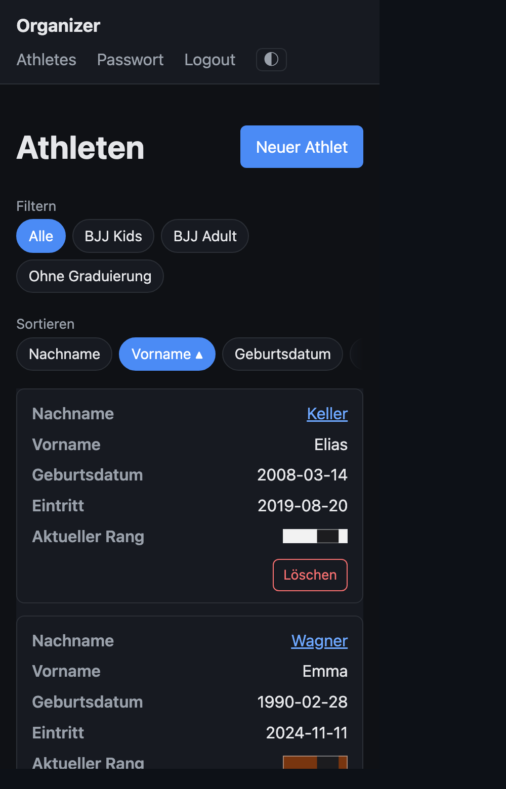
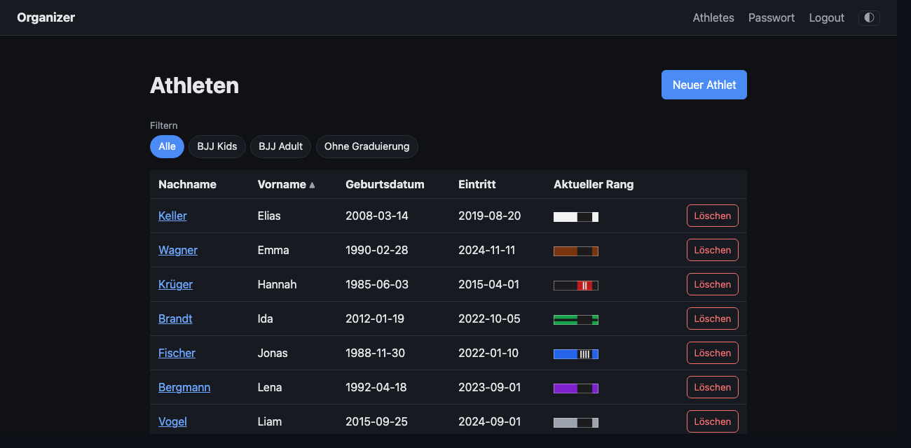
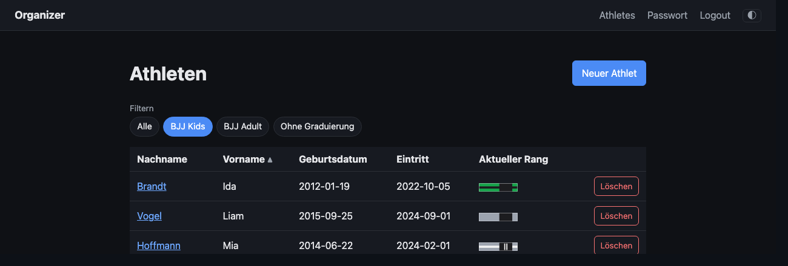

# 01 — Filter the roster by current grading system

Status: done

Let a trainer narrow the athlete roster (`/athletes`) to one cohort, e.g. show
only kids or only adults, by filtering on the grading **system** of each
athlete's current rank.

Parked deliberately out of the sortable-roster feature
([[roster-sortable-columns]]). It composes cleanly on top of the sort work: it
reuses the same derived "current rank → system" key and the same URL carrier.

## Why it matters

Once kids and adults share one roster, the cross-system rank sort groups the two
cohorts into blocks (kids then adults; see roster-sortable-columns decision). A
cohort filter removes that concern entirely — pick one system and every athlete
shown is in one comparable system. That is the filter's whole promise, and
several decisions below exist only to keep it true.

## Domain subtlety

An athlete is **not** bound to a single grading system (ADR-0001) — history may
cross kids→adult. So "filter by kids/adults" means **filter by the system of the
athlete's *current* rank** (the derived attribute), not a fixed field on the
athlete.

It is a grading-**system** filter, not a cohort filter. `CONTEXT.md` defines a
`GradingSystem` as an ordered set of ranks for one *discipline-and-cohort*, so
the cohort is a component of a system's identity, not an entity of its own. With
one discipline the two coincide 1:1, which is why "kids/adults" feels like the
axis; add "Judo Kids" and a cohort filter would span two systems and re-create
the very blocks this filter removes. "Cohort" therefore does not enter the domain
model — see ADR-0007. The directory keeps its `roster-cohort-filter` slug only
because `[[…]]` links to it already exist in ADR-0005, `rosterview.go` and
neighbouring tickets.

## Decisions

Settled at triage on 2026-07-30. Recorded as ADR-0006 (slug identity) and
ADR-0007 (option source, validation, invariant); the reasoning and the rejected
alternatives live there rather than being repeated here.

**Options and selection**

- **Single-select.** Multi-select over two systems has four states, two of which
  mean "all", and selecting two systems would break the filter's promise by
  construction. An explicit `Alle` chip renders the unfiltered state, so exactly
  one chip carries `aria-current` at any time — parallel to the sort row.
- **Ungraded athletes get their own option**, `Ohne Graduierung`, last in the
  row. They are hidden by any system filter (a system filter cannot match an
  athlete who has no system) and shown under `Alle` or their own option. This
  makes the options a **partition** of the roster and gives the trainer "who
  still needs a first promotion" as one click. `Ungraded` is now a `CONTEXT.md`
  term; `athlete_detail.html` already says "noch keine Graduierung" for the same
  state.
- **The options are the non-empty cells of that partition**, derived from the
  **unfiltered** roster — not the seeded systems. Both systems are always seeded
  but v1 is kids-only, so seeded options would render a permanently empty
  `BJJ Adult` chip. Deriving them from the *filtered* roster would delete the way
  back.
- **The row renders only from two options upward.** With one, `Alle` and that
  option show the same list. So the filter is absent in a homogeneous roster and
  surfaces by itself once there is something to partition.

**URL**

- **`?system=<slug>`**, joining `?sort=`/`?dir=` on the existing carrier
  (`rosterView` in `internal/web/rosterview.go`). The slug is a new column on
  `grading_systems` (ADR-0006): `bjj-kids`, `bjj-adult`.
- Values: `""` = `Alle` (no query parameter at all, so a bare `/athletes` keeps
  working and `query()` still returns `""` for the default view), `"none"` =
  ungraded, otherwise a system slug.
- **The field stays a `string`.** An integer would collapse "Alle" and "ungraded"
  onto the same zero value, and `defaultRosterView` depends on the zero value
  being exactly the default view. A string field also keeps `rosterView`
  comparable with `==`, which `query()` relies on.

**Validation (two-stage)**

- **Form**, in `rosterViewFrom`, pure and DB-free: slug shape (`[a-z0-9-]`,
  bounded length), `none`, or empty — anything else reads as empty. All nine call
  sites stay cheap, no user-controlled string reaches a rendered URL or a
  `Location` header, and `query()` needs no escaping.
- **Representation**, in the roster handler only: an option that is not
  represented falls back to `Alle`. The eight other call sites carry the value
  through and never consult the database.
- **One query feeds both.** The handler loads the unfiltered roster once and
  derives the options *and* the filtered rows from that same slice, via pure
  functions over `[]RosterRow` in `store`. `ListRoster` keeps its signature — the
  filter does not go into the SQL.

**Zero hits: unreachable, by construction**

Every offered option has ≥1 athlete; every non-offered value falls back to
`Alle`. So a filter never yields an empty roster, and an empty roster means no
athletes exist. `athletes.html` is therefore **not** restructured: both chip rows
stay inside `{{if .Athletes}}`, which is correct rather than merely tolerable, and
no "no matches" message or reset link is built. Because one query feeds both
sides, this holds structurally, not by test — there is no second source to drift.

**Labels**

- Chip labels are the **raw seed names** (`BJJ Kids`, `BJJ Adult`). The raw system
  name already renders in the German UI at four places (`athletes.html` rank cell;
  `athlete_detail.html` current rank, promotion form, history table), and
  [[i18n-domain-data]] explicitly accepts that interim state. Translating only the
  chips would put `BJJ Kinder` next to `BJJ Kids` in the same view.
- The row carries a visible muted **`Filtern`** label (ADR-0005 requires an
  equivalent to `Sortieren`; two unlabelled chip rows on a phone are
  indistinguishable). Verb-parallel to `Sortieren`, and a verb survives the row
  holding both systems and the absence of a system — `Graduierungssystem` would
  not be accurate, `Kohorte` is not a model term.
- The filter row sits **above** the sort row: narrow first, then order.

## Scope

- Migration `00004_grading_system_slug.sql`, following `00003` exactly: add the
  column with a default; the seed fills it on the next boot as
  `ensureGradingSystem` already does for `sort_order`.
- `seed.go`: `slug` on `gradingSystemSeed` and on both seeded systems;
  `ensureGradingSystem` writes it on both paths.
- `store`: `SystemSlug` on `RosterRow` (the subquery already has `g.id`/`g.name`
  to hand); two pure functions over `[]RosterRow` — derive the present options,
  and restrict rows to one option.
- `internal/web/rosterview.go`: `system` field, its syntactic normalisation in
  `rosterViewFrom`, one entry in `query()`, and the corrected comment about fixed
  *shape* rather than fixed *set*.
- `internal/web/roster.go`: the filter chip view model, the representation
  fallback, and the ≥2-options rule.
- `athletes.html`: the filter chip row above the sort row. No structural change.
- `app.css`: **the filter row is visible at every width, unlike the sort row.**
  `.sort-controls` is `display: none` globally and switched on only inside
  `@media (max-width: 600px)`, because above that the desktop `<th>` links are the
  sort surface. The filter has no `<thead>` equivalent, so it has no desktop
  surface to defer to and must always render. Two consequences: the filter row
  needs its own container class with no display gate rather than reusing
  `.sort-controls`, and the chip appearance (`.chip`, `.chip.active`, currently
  nested under `.sort-chips` *inside* the phone block, so no `.chip` rule exists
  above 600px at all) has to be hoisted out into a general rule that both rows
  share. What stays phone-only is the *overflow* behaviour — the sideways scroll,
  the snap points and the mask fade exist because five full German labels do not
  fit a phone; the filter's three-to-four chips have room on a desktop.
  Consequently ADR-0005's reason for the visible `Filtern` label — two unlabelled
  chip rows stacked on a phone are indistinguishable — applies at phone width
  only. Above it the filter row stands alone, where the label still earns its
  place by naming what the row does.

## Acceptance

- The roster can be narrowed to athletes whose current rank is in a chosen
  grading system, and reset to all via the `Alle` chip.
- Ungraded athletes are reachable as their own option and hidden by every system
  filter.
- Filter and column sort compose in one URL; every link out of the roster and all
  four mutation redirects preserve both, without those call sites being touched.
- A bare `/athletes` still renders with no query string.
- An unknown, malformed or unrepresented `?system=` resolves to `Alle` rather
  than erroring or emptying the table.
- The filter row is absent when the roster offers fewer than two options.
- A test pins that a slug-shaped but unrepresented value round-trips to the
  default view, and that no offered option yields an empty roster.
- The chip row renders correctly at **both** widths — verified visually at ~375px
  and on a desktop width, as [[roster-sort-on-mobile]] did — since the sort row's
  CSS covers phone widths only and the shared chip styling is new above 600px.

## Comments

> *This was generated by AI during triage.*

2026-07-27 — Cross-check against [[roster-sort-persistence]] (triaged the same day,
`ready-for-agent`): that ticket makes the roster's view state travel in the **URL**
through every outgoing link and every mutation redirect, and its brief asks for the
carrier to be the view state generally rather than a hard-wired `sort`/`dir` pair —
precisely so `?system=` can join it later as one whitelist entry. So the open
question "does the filter compose with the column sort in the URL" is answered in
advance: **yes, same URL, same carrier.** What still needs grilling here is the
filter's own substance — ungraded athletes, the filter surface, and what defines the
choices. Build order matters only in that doing this before sort-persistence would
mean building the carrier twice.

2026-07-27 — The open question **"filter surface"** is now partly pre-answered by the
triage of [[roster-sort-on-mobile]], which produced
[ADR-0005](../../../docs/adr/0005-table-controls-live-outside-the-table.md):

- **Shape is decided: a row of links, not a form.** ADR-0005(b) — a link's `href` is
  built server-side from the whole view state, while a `GET` form submits only its
  own fields and silently drops anything not mirrored into a hidden input. A filter
  built as a form would be reset by every sort, invisibly. So "system dropdown vs.
  cohort chips/tabs" resolves to **chips/tabs**; a `<select>` is ruled out on
  correctness grounds, not taste.
- **The filter row will sit directly above/below the sort chip row** on phone widths.
  That is why the sort row gets a visible muted "Sortieren" label — two unlabelled
  chip rows stacked on a phone are indistinguishable. Give this one an equivalent
  label from the start.
- **Still genuinely open here:** ungraded athletes, what defines the choices, and
  whether the filter is single- or multi-select.

2026-07-27 — [[roster-sort-persistence]] 01 is done, so the carrier now exists:
`rosterView` in `internal/web/rosterview.go`. Adding `?system=` is a field on that
struct, a line in `rosterViewFrom` (whitelisted against the grading systems, the way
`sort` goes through `store.NormalizeRosterSort`) and a line in `query()`. Every link
out of the roster, every sort control and all four mutation redirects already build
their URLs from it, so none of them need touching. Note `query()` returns `""` for
the default view — whatever "no filter" means must stay part of that default so a
bare `/athletes` keeps working.

2026-07-30 — Triaged in a grilling session; all open questions are now decisions
(see **Decisions** above), status `ready-for-agent`. Two ADRs came out of it:
[ADR-0006](../../../docs/adr/0006-grading-system-identity-is-a-slug.md) and
[ADR-0007](../../../docs/adr/0007-roster-filter-options-come-from-the-roster.md).
`CONTEXT.md` gained `Ungraded` and a sharpened `GradingSystem` (identity separate
from display name); "cohort" was deliberately *not* added.

Three notes on how the reasoning moved, for anyone re-opening this:

- The prior comment above assumed the whitelist would work like
  `store.NormalizeRosterSort` — a fixed set. It cannot: the valid systems are
  **data**, while `NormalizeRosterSort` is a static map lookup and `rosterViewFrom`
  is a pure function of the request with nine call sites. That forced the two-stage
  split (form everywhere, representation in the roster handler only). Making
  `rosterViewFrom` a method on `*Server` was considered and rejected in ADR-0007.
- **The zero-hit problem dissolved rather than being solved.** It was raised as a
  real defect — `athletes.html` wraps the chip row and the table together, so an
  empty filter takes the reset with it. Once the options are derived from the roster
  and unrepresented values fall back to `Alle`, the state is unreachable, so the
  template needs no change at all. The trade is a load-bearing invariant instead of
  a piece of UI; ADR-0007 records "no representation check plus a zero-hit UI" as
  the coherent way back if that ever feels too clever.
- **The CSS is not symmetric with the sort row**, found while checking the scope
  after triage and recorded above: the sort row is phone-only because the desktop
  has header links, the filter row has no such fallback and must render at every
  width. That means hoisting the chip appearance out of the phone media block, not
  reusing `.sort-controls`. Worth a visual check at both widths, the way
  [[roster-sort-on-mobile]] did at 375px.
- **Ordering against [[i18n-domain-data]]:** this ticket first. It is fully
  specified while that one is `needs-triage` with an open question waiting on
  [[rank-belt-visual]], and no work is duplicated either way — the slug/name split
  makes the chips i18n-agnostic. The slug column also shrinks that ticket's open
  question, since `name` becomes a display label rather than an identity.

2026-07-30 — Implemented; every decision above went in as written, so this note
only records what the ticket left to the implementation.

- **`RosterRow` gained a `SystemOrder` next to the `SystemSlug` the scope names.**
  The chips are ordered by the systems' seeded progression order — kids before
  adult, the same order the rank sort blocks them in — and that order had to come
  from somewhere. Without it the option order would fall out of row order and
  reshuffle whenever the trainer changed the sort column, and ordering by name or
  slug would put `BJJ Adult` first, against the order used everywhere else. The
  column was **already** selected in the `ListRoster` subquery (`g.sort_order AS
  system_order`) for the rank sort, so this costs no query change. Systems that
  share a `sort_order` fall back to the slug, because `slices.SortFunc` is not
  stable and `sort_order` defaults to 0 (migration 00003).
- **The chip appearance moved further than "hoist `.chip` out of the phone
  block".** `.sort-controls-label` became `.chip-row-label` because both rows now
  share it, `.filter-controls`/`.sort-controls` share one `margin-bottom`, and
  `.sort-chips, .filter-chips` share the flex row. What stayed inside
  `@media (max-width: 600px)` is only what the ticket said should: the sort row's
  `flex-wrap: nowrap`, its sideways scroll, the snap points and the mask fade.
  The filter row **wraps** instead of scrolling — at 375px its four chips take two
  lines, which keeps every option visible without a hidden overflow.
- **The reserved `none` needs no special case in the form check.** It is
  slug-shaped, so `[a-z0-9-]` already admits it; a separate early return would
  have been dead code.

Verified in Chrome at 375px and 1280px with the `seed-demo` roster (which spans
all three cells — Sophie Neumann is ungraded, Elias Keller's history crosses
kids→adult and so counts as adult):

- At 375px both rows render, each under its own muted label, filter above sort.
  The filter's chips wrap to two lines; the sort row still scrolls sideways and
  fades at the right edge.
- At 1280px the filter row still renders while the sort row does not — the
  `<thead>` links carry the sort there, and `Vorname ▲` shows on the header.
- `?system=bjj-kids` narrows 12 athletes to the 6 kids, marks `BJJ Kids` with
  `aria-current`, and leaves `Alle` linking to a bare `/athletes`. Elias Keller is
  correctly absent: his *current* rank is the adult one.

