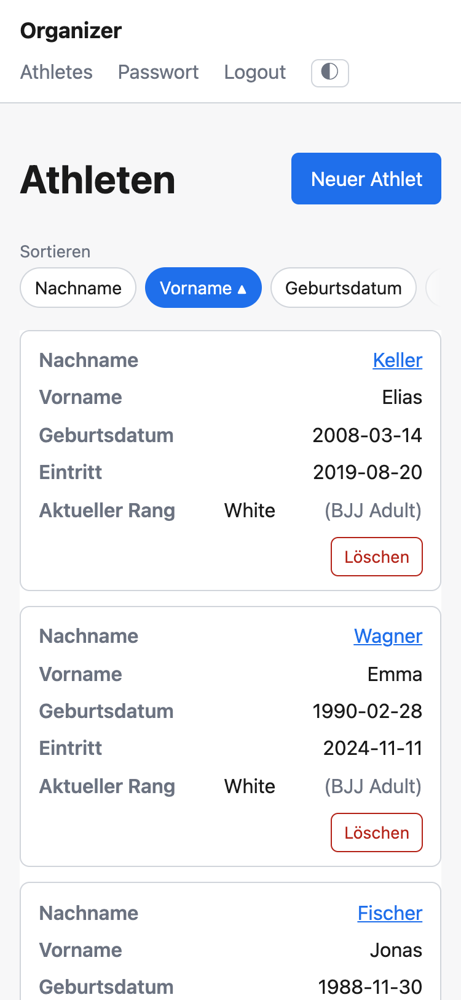
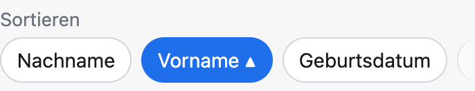
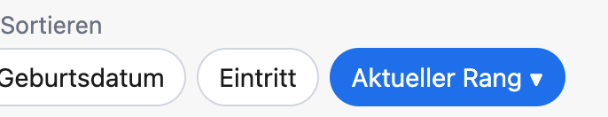

# 01 — Roster sorting has no affordance on phone widths

Status: done
Blocked by: — (was [[roster-sort-persistence]] 01, done in `9492af0`)

The roster's sortable column headers are unreachable on a phone. Found by the
code review of [[roster-sortable-columns]] (shipped in `c8ff458`, 2026-07-27).

## Motivation

`app.css`'s `@media (max-width: 600px)` block turns every table into a stack of
labelled cards and moves `thead` off-screen (`position: absolute; left: -9999px`)
so it stays in the accessibility tree without showing. The sort links live in
those `<th>`s, so on a phone there is visually nothing to click: the roster is
permanently in the default Vorname-ascending order.

Not a regression — the previous single Nachname toggle sat in the same hidden
`thead` — but the feature whose whole point is "click any column to sort" now has
no mobile surface. The kids trainer is exactly the phone user.

## Resolved in triage (2026-07-27)

Grilling + domain-modeling session. The three open questions the ticket carried
are answered; the reusable parts are recorded as
[ADR-0005](../../../docs/adr/0005-table-controls-live-outside-the-table.md).

- **Two surfaces, one truth.** A phone-only chip row; the desktop keeps its
  header links. Rejected replacing the header links with a single control for all
  widths: that would discard both the click-the-column idiom and the `aria-sort`
  attributes, which on a real desktop table are genuine assistive-technology
  signal. Two surfaces are only expensive if they have two truths — these render
  from the same `rosterColumns` and the same resolved sort state.
- **Chips, not a `<select>`.** The deciding argument is correctness, not
  convenience: a chip is an `<a href>` whose URL is built server-side and
  therefore carries the *whole* view state, while a `GET` form submits only its
  own fields and would silently drop `?system=` from
  [[roster-cohort-filter]] the moment someone forgets a hidden input. No error,
  no failing test — just a filter that resets whenever a trainer sorts. Secondary:
  one tap instead of two (ADR-0002 rules out an `onchange` submit), and the chip
  reuses the existing header view model verbatim.
- **Depends on [[roster-sort-persistence]].** Built first, this ticket would
  hard-wire today's `fmt.Sprintf("/athletes?sort=%s&dir=%s", …)` and be
  refactored days later. Built second, the chips render whatever the view-state
  builder already produces.
- **`thead` goes to `display: none` at ≤600px**, globally — the promotion history
  table included. `display: block` on the table elements already removes the
  implicit `table`/`row`/`cell` roles, so the off-screen `thead` associates
  nothing; the card labelling is done by `td[data-label]::before`. Without this
  the phone would carry two full sets of sort links in the accessibility tree.
  See ADR-0005(a).
- **Full labels, horizontally scrolling.** Rejected a `ShortLabel` field: it would
  be the third German copy of each column name in the codebase (after
  `rosterColumns` and the `data-label` attributes), and
  [[i18n-ui]] — already `ready-for-agent` — flags those labels as a special case
  because they live in Go rather than a template. Abbreviations are also
  per-language, so they are not mechanically derivable. Scroll discoverability is
  a CSS problem; shortening later is a cheap follow-up, the reverse is not.
- **Accessibility package.** `aria-sort` cannot simply move to a chip — it is only
  valid on an element with role `columnheader`/`rowheader`. The active chip gets
  `aria-current="true"` plus visually hidden direction text; the ▲/▼ glyph becomes
  `aria-hidden="true"` **including on the desktop header**, where `aria-sort`
  already carries the meaning and the bare glyph is read out as a character name.
- **No new domain terms.** `CONTEXT.md`'s glossary holds domain nouns (Athlete,
  Trainer, Promotion, GradingSystem, Rank). "View state" and "sort chip" are
  application concepts; recording them there would dilute the glossary. They
  belong in ADR-0005, following the precedent of ADR-0004.
- **Promotion history table.** Not sortable (`athlete_detail.html:44-61` has three
  plain `<th>`), so it gets no chips. Its `thead` is affected only by the global
  rule above.

## Comments

> *This was generated by AI during triage.*

2026-07-27 — Implemented. `athletes.html` renders `.Headers` twice — once as the
`<th>` links, once as `.sort-chips` — and `app.css` decides which surface exists
at a given width: `.sort-controls` is `display: none` outside the ≤600px block,
where `thead` is now `display: none`. Two notes on the implementation:

- **Active-ness became a field.** `rosterHeader` gained `Active` and `Descending`
  (`internal/web/roster.go`). Without them the two surfaces each had to infer the
  active column from one of the presentation strings — `{{with .Indicator}}` on
  the `<th>`, `ne .AriaSort "none"` on the chip — which is two encodings of the
  one thing ADR-0005 says both surfaces must agree on. The German direction word
  stays in the template, next to the other German copy in the markup, rather than
  becoming a third German string in Go (see the `ShortLabel` note above).
- **The fade is prefixed.** Unprefixed `mask-image` needs iOS 15.4, and an older
  iPhone is exactly the device the chip row exists for, so `-webkit-mask-image`
  sits beside it. `scroll-snap` still works where neither is supported.

Verified in Chrome at 375 × 812 with the `seed-demo` roster:

- `thead` computes to `display: none` and the chip row to `display: block`; at
  1200px it is exactly the other way round, with `aria-sort` on all five headers.
- Tapping *Nachname* → `?sort=lastName&dir=asc`, tapping it again → `&dir=desc`;
  scrolling right and tapping *Aktueller Rang* → `?sort=rank&dir=asc`. The chip
  then reads `Aktueller Rang ▲, aufsteigend sortiert`, with the glyph
  `aria-hidden`, and carries `aria-current="true"`.
- The row overflows (549px of chips in 343px) and the next chip fades out at the
  right edge, which is what makes the overflow readable.

2026-07-27 — Follow-up, on request: the desktop click target is now the whole
header cell, not just the column name. `th.sortable` gives up its padding and the
link takes it over, so the link fills the cell (verified: clicks on the right
edge, the top-left corner and the bottom edge all sort), and the cell highlights
on hover like the roster rows do. The class sits on the cell rather than on a
`th:has(a)` selector so the plain headers of the promotion history table keep
their padding. The phone chips were already tap-sized.

## Agent Brief

**Category:** enhancement
**Summary:** Give the roster a usable sort affordance at phone widths: a
horizontally scrollable row of sort chips above the table, rendered from the same
resolved header state as the desktop column links.

**Current behavior:**
The roster sorts server-side from `?sort=<col>&dir=<asc|desc>`. `rosterHeaders`
(`internal/web/roster.go:57`) resolves the active column and direction and builds
one `rosterHeader{Label, Href, Indicator, AriaSort}` per column from
`rosterColumns`; `athletes.html:13` renders each as a `<th>` containing a link.
At ≤600px `app.css:300-303` positions `thead` off-screen, so those links are the
only sort affordance and they are invisible and unclickable. A trainer on a phone
is stuck in Vorname-ascending.

**Desired behavior:**
At ≤600px a chip row sits above the roster table: one chip per sortable column,
each a plain link to that column's sort URL, the active one visually marked and
carrying the direction indicator. Tapping a chip sorts; tapping the active chip
reverses direction — identical semantics to the desktop header links, because it
is the same view model. Above 600px the chip row is not rendered visually and the
header links behave exactly as they do today. Nothing about the sort mechanism,
the columns, the default or the tie-break changes.

**Key interfaces:**
- `rosterHeaders` already produces everything a chip needs (`Label`, `Href`,
  `Indicator`, `AriaSort`). Render the same range twice in `athletes.html` — once
  as `<th>`, once as chips. Do **not** add a parallel view model, and do not add
  fields to `rosterColumns`.
- This ticket was **blocked by [[roster-sort-persistence]] 01**, which is now done:
  `rosterHeaders(view rosterView)` builds every `Href` as
  `view.sortedBy(col.Key).path(rosterPath)`, so the chips inherit the whole view
  state for free and `?system=` can join later without touching this markup.
  Nothing here reads the query string or spells a URL itself.
- The chip row is a `<nav>` labelled by a visible, muted "Sortieren" line above
  it, via `aria-labelledby` (not a separate `aria-label`, to avoid a double
  announcement). The label sits on its own line so it costs vertical, not
  horizontal, space — the row's width budget is already tight with five full
  German labels.
- Active chip: `aria-current="true"`, plus visually hidden text stating the
  current direction (accessible name reading like "Vorname, aufsteigend
  sortiert"). `app.css` has no visually-hidden utility yet — add a small `.sr-only`
  one; the existing helpers are `.sort-dir` (`app.css:135`) and `.muted`
  (`app.css:234`).
- In the ≤600px block, replace the off-screen `thead` rule with `display: none`
  and correct the comment at `app.css:291-292`, which currently claims an
  accessibility benefit that the `display: block` rules directly beneath it
  cancel out. This is global and intentionally also affects the promotion history
  table.
- Also set `aria-hidden="true"` on the ▲/▼ glyph in the desktop header
  (`athletes.html:13`). Same line of markup, same defect: `aria-sort` already
  carries the meaning there and the glyph is announced as a character name.

**Acceptance criteria:**
- [x] At ≤600px a trainer can select any of the five sortable columns and reverse
      the direction, and the active column and its direction are visible.
- [x] The chips link to the same URLs as the desktop header links — verified by a
      test that asserts both surfaces emit the same `href` per column.
- [x] The active chip carries `aria-current="true"` and a visually hidden
      direction text; inactive chips carry neither.
- [x] Above 600px the rendered page behaves as it does today: header links work,
      `aria-sort` is present, the chip row is not visible.
- [x] `thead` is `display: none` at ≤600px, and no sort link is reachable twice in
      the accessibility tree at phone widths.
- [x] The ▲/▼ glyph is `aria-hidden` in both surfaces.
- [x] The four existing tests in `internal/web/roster_test.go` still pass
      unchanged.
- [x] **Visual check before closing:** render `/athletes` at ~375px width with a
      populated roster, confirm the chip row is usable and that the horizontal
      scroll is discoverable (fade edge / scroll-snap), and attach a screenshot.
      A test can assert the markup; it cannot assert that the row reads as a
      control. Use the `/run` skill to launch the app.

**Out of scope:**
- Sort chips on the promotion history table — it is not sortable.
- Any change to the sort mechanism, the default column, the tie-break rules or
  the set of sortable columns.
- Shortening the column labels for phone widths; see the triage note.
- The cohort filter itself ([[roster-cohort-filter]]). Its control row will sit
  next to this one and should follow ADR-0005(b), but do not build it here.
